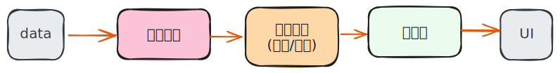

# Jetpack Compose 단계

사용자한테 시각적인 UI가 보일 때까지 Jetpack Compose 는 3개의 주요 단계를 거치게 됩니다.  
이는  
컴포즈가 컴포저블 함수를 실행해서 UI 트리를 만드는 **컴포지션** 단계,  
UI 트리를 읽고 각 노드의 크기를 ***측정*** 하고 ***배치*** 하는 단계인 **레이아웃** 단계,  
배치된 UI를 기기 화면에 그리는 단계인 **그리기(Drawing)** 단계가 있습니다.  

이러단 단계는 일반적으로 순서대로 진행하여 프레임을 생성합니다.
하지만 BoxWithConstraints, LazyColumn, LazyRow은 예외로, 하위 요소의 컴포지션이 상위 요소의 레이아웃 단계에 따라 달라집니다.(이거는 나중에 분석해 보기로 합니다.)

또한 컴포즈는 성능을 최적화하기 위해서 동일 데이터(State)가 변경될 때에는 이러한 단계를 최대한 스킵한다.

# 단계 과정 이해하기

## 1. 컴포지션(Composition)

앞선 포스트 "Compose 수명주기" 에서도 여러번 설명한 **컴포지션 단계** 입니다.  
Compose 런타임이 컴포저블 함수를 실행하고 **UI 트리를 출력** 합니다.  
>(조금 자세히 찾아보니 컴포지션은 **SlotTable** 이라는 내부 구조에 UI 생성 로직과 데이터를 저장하며, 이 로직이 실행되어 **LayoutNode** 라는 실제 렌더링 및 레이아웃을 위한 UI 트리를 구성한다고 하는데... 나중에 자세히 알아보는걸로..)

## 2. 레이아웃(Layout)

앞선 컴포지션 단계에서 생성된 UI 트리를 바탕으로 **측정(measure)**, **배치(layout)** 순서로 진행됩니다.  
레이아웃 단계는 루트를 시작으로 3단계 알고리즘을 순회 합니다.
1. **하위 요소 측정(Measure children)**: 노드의 하위 요소가 있을 경우 하위 요소를 측정합니다.  
2. **자체 크기 결정(Decide own size)**: 측정 값을 기반으로 노드가 자체 크기를 결정합니다.  
3. **하위 요소 배치(Place Children)**: 각 하위 노드는 노드의 자체 위치를 기준으로 배치됩니다.  
이 단계가 끝나면 각 레이아웃 노드는 자체 크기(너비/높이), 위치(x/y좌표) 를 가지게 됩니다.  

아래의 UI 트리를 예를 들어서 설명해보면

#### 측정 및 크기 결정 단계
- **1단계**: Row가 하위 요소를 측정합니다.
    - Row는 자신의 하위 요소인 Image와 Column을 측정합니다. 이때 Row는 자신의 제약 조건을 각각의 하위 요소에 전달합니다.
- **2단계**: Image가 측정됩니다.
    - Image는 하위 요소가 없으므로 전달받은 제약 조건 내에서 자체 크기를 결정합니다.
    - 결정된 크기(너비와 높이)를 Row에 다시 보고합니다.
- **3단계**: Column이 측정됩니다.
    - Column은 다음에 측정됩니다. Column은 자신의 하위 요소 (Text1, Text2)를 측정해야만 자신의 크기를 결정할 수 있습니다.
    - Column은 자신이 Row로부터 받은 제약 조건을 조정하여 하위 요소 (Text1, Text2)에 전달합니다.
- **4단계**: Text1과 Text2가 측정됩니다.
    - Text1이 먼저 측정됩니다. 하위 요소가 없으므로 전달받은 제약 조건 내에서 자체 크기를 결정하고 Column에 다시 보고합니다.
    - Text2도 마찬가지로 측정되고 Column에 크기를 보고합니다.
- **5단계**: Column이 자체 크기를 결정합니다.
    - Column은 하위 요소 (Text1, Text2)로부터 보고받은 크기를 사용하여 자체 크기를 결정합니다.
        - 너비: 하위 요소 중 가장 큰 너비를 자신의 너비로 사용합니다.
        - 높이: 하위 요소 높이의 합을 자신의 높이로 사용합니다.
    - 결정된 최종 크기를 Row에 다시 보고합니다.
- **6단계**: Row가 자체 크기를 결정합니다.
    - Row는 하위 요소 (Image, Column)로부터 보고받은 크기를 사용하여 자체 크기를 결정합니다.
        - 너비: 하위 요소 너위의 합을 자신의 너비로 사용합니다.
        - 높이: 하위 요소 중 가장 큰 높이를 자신의 높이로 사용합니다.

#### 배치 단계
- **7단계**: Column이 하위 요소를 배치합니다.
    - Column은 Text1과 Text2를 자체에 상대적으로 세로로 서로 아래에 배치합니다.
- **8단계**: Row가 하위 요소를 배치합니다.
    - Row는 Image와 Column을 자체에 상대적으로 가로로 나란히 배치합니다.

> 💡 하위 요소의 최종 너비/높이는 Modifier.height(), Modifier.width(), Modifier.padding(), 그리고 상위 요소가 전달한 제약 조건 등 모든 **수정자(Modifier)** 의 영향을 받아 결정됩니다.

## 3. 그리기(Drawing)

그리기 단계는 UI 트리가 다시 위에서 아래로 순회하면서 각 노드가 차례로 그려지게 됩니다.

아까의 레이아웃 단계의 예로 들면
1. Row 의 배경색과 같은 컨텐츠를 그립니다.
2. Image 가 자체적으로 그려집니다.
3. Coloumn 이 자체적으로 그려집니다.
4. Text1, Text2 가 각각 자체적으로 그려집니다.